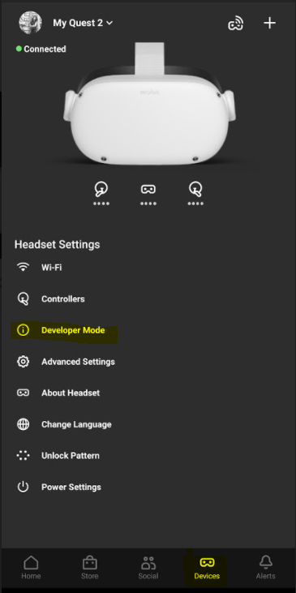
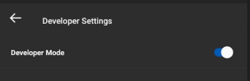
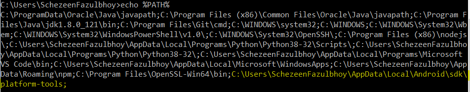
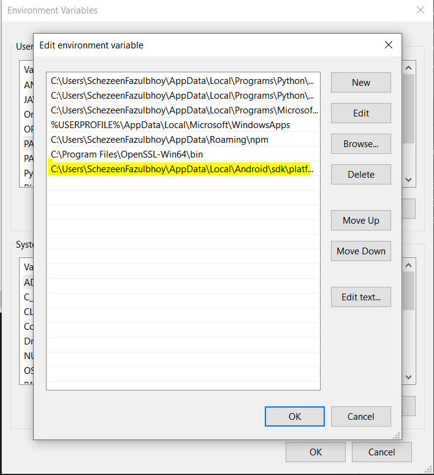
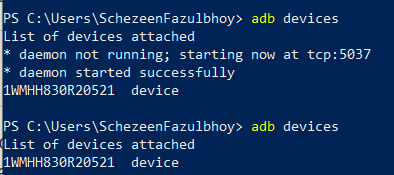

# Development Setup: Oculus

## Enabling Developer Mode
- Download the Oculus App and login using Facebook
- Turn on the headset
- Navigate to devices and select the device
- Click on 'Developer Mode' and enable it by toggling the switch

<table>
    <tr>
        <td> </td>
        <td>  </td>
    </tr>
</table>

## Development Environment Setup on your OS
- Connect the Oculus device to your machine via USC-C, and upon being prompted, [Enable Developer Mode](https://developer.oculus.com/documentation/native/android/mobile-device-setup/)

- Install [ADB driver](https://developer.oculus.com/downloads/package/oculus-adb-drivers/) for your OS 

__For Windows__

- Check if the ADB driver path is configured in your global path variable by using the command `echo %PATH%`

- If is it configured correctly, it should be visible such as
 

- If you cannot see this path `C:\Users\USERNAME\AppData\Local\Android\sdk\platform-tools` present, add it your environment variables either by using the command `setx PATH "%PATH%;C:\Program Files\android-sdk-windows\platform-tools"` or manually by navigating to environment variables and ammending the environment variable: *PATH*

 

- To check whether your device is connected correctly, use the command `adb devices`. If all is good and the device is detected, you should see the following output:

 

-  [Enable Wifi Debugging](https://developer.oculus.com/documentation/oculus-browser/browser-remote-debugging/)

## Additional Resources
- [Oculus Developer Documentation](https://developer.oculus.com/develop/)

