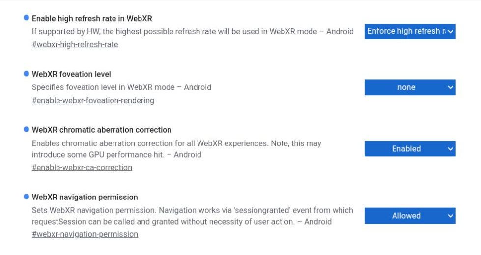
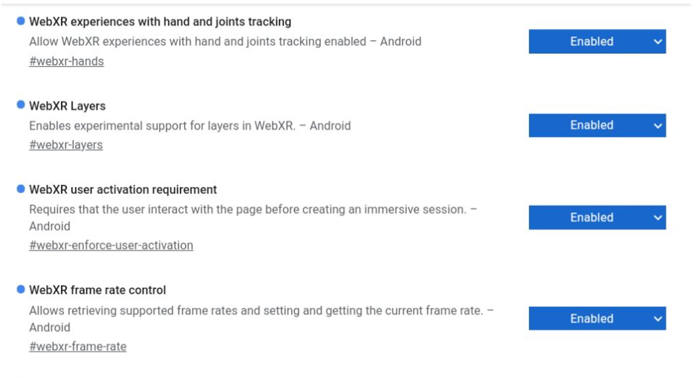
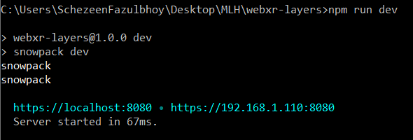
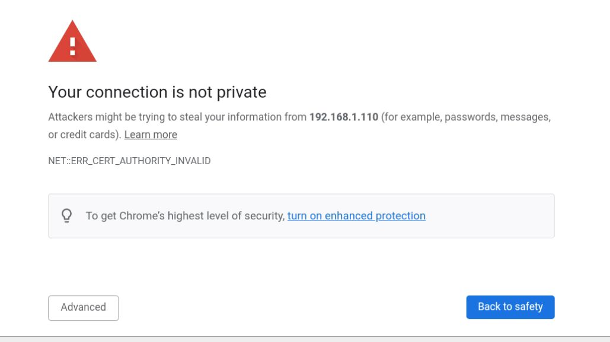
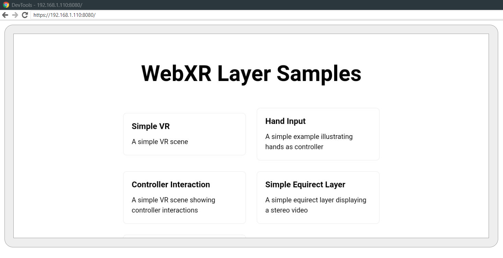

# Development Setup: Oculus

## Enabling Developer Mode
- Download the Oculus App and login using Facebook
- Turn on the headset
- Navigate to devices and select the device
- Click on 'Developer Mode' and enable it by toggling the switch

<table>
    <tr>
        <td> </td>
        <td>  </td>
    </tr>
</table>

## Development Environment Setup on your OS
- Connect the Oculus device to your machine via USC-C, and upon being prompted, [Enable Developer Mode](https://developer.oculus.com/documentation/native/android/mobile-device-setup/)

- Install [ADB driver](https://developer.oculus.com/downloads/package/oculus-adb-drivers/) for your OS 

__For Windows__

- Check if the ADB driver path is configured in your global path variable by using the command `echo %PATH%`

- If is it configured correctly, it should be visible such as
 

- If you cannot see this path `C:\Users\USERNAME\AppData\Local\Android\sdk\platform-tools` present, add it your environment variables either by using the command `setx PATH "%PATH%;C:\Program Files\android-sdk-windows\platform-tools"` or manually by navigating to environment variables and ammending the environment variable: *PATH*

 

- To check whether your device is connected correctly, use the command `adb devices`. If all is good and the device is detected, you should see the following output:

 

-  [Enable Wifi Debugging](https://developer.oculus.com/documentation/oculus-browser/browser-remote-debugging/)

## Enabling Flags in the Oculus Browser
In order to run a WebXR based application in the Oculus Browser, we need to establish certain flags. Navigate to `chrome://flags/` and enable the following flags:

    webxr-layers
    webxr-hands
    webxr-high-refresh-rate
    enable-webxr-foveation-rendering
    enable-webxr-ca-correction
    webxr-navigation-permission
    webxr-enforce-user-activation
    webxr-frame-rate

## Running a local application in the Oculus Browser
- To run a WebXR application in the browser, HTTPs is required. Before running your application locally, ensure that OPENSSL is configured 

- Run the `webxr-layers` application using `npm run dev` in your local terminal

- The application is now running on `https://localhost:8080` or on your network at `https://<ip>:port`

There are 3 ways to view the application running locally within your oculus browser:

###  1. Visit network address `https://<ip>:port` within your Oculus Browser 
Ensure that your oculus device and local machine are both connected to the same WiFi network, and that the oculus device is connected to your machine

If prompted with the *your connection is not private* screen, click on *advanced* and then *proceed to _IP:PORT_ url*. This  should redirect you to the locally running application and allow you to interact with it.

<table>
    <tr>
        <td> </td>
        <td>  </td>
    </tr>
</table>

## Additional Resources
- [Oculus Developer Documentation](https://developer.oculus.com/develop/)

