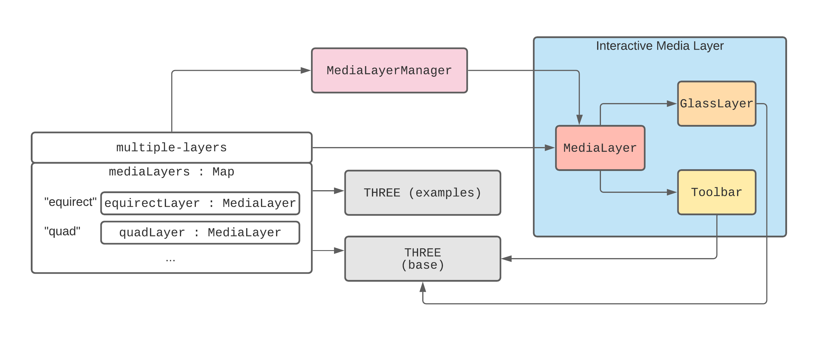

# WebXR Layers Sample

Composition of WebXR layers has [significant benefits](https://www.w3.org/TR/webxrlayers-1/#intro). This application is a small collection of samples that demonstrate creating and interacting with video layers in an XR environment. Because video layers cannot be interacted with directly via a controller, a 3D rendering library is used to achieve the desired interactions, including video playback controls, and moving and resizing layers. [Three.js](https://threejs.org/docs/index.html#manual/en/introduction/Creating-a-scene) is the choice of 3D rendering library for this application.

This project is a product of an [Major League Hacking (MLH) Spring 2021 Fellowship](https://developers.facebook.com/blog/post/2021/03/31/facebook-open-source-introduces-mlh-fellowship-class-spring-2021/) open source contribution.

## Design

This section provides a general overview of the application and a high-level explanation of how it works. The web application consists of several samples, each meant to showcase a particular feature. However, `multiple-layers.js` can be considered to be the most complex sample that is meant to show:

- Rendering multiple video layers of multiple types (e.g. equirect, quad)
  - Independent playback
- Interacting with individual video layers
  - Playback controls
  - Moving quad layers
  - Resizing quad layers

The following is a labeled screenshot of the `multiple-layers` sample.


## Application Architecture



This diagram shows a high-level overview of a particular sample. This sample has two media layers: one equirectangular layer and one quadrilateral layer. Breaking the diagram into four main components:

1. `multiple-layers` is the application sample and the "driver"
2. The two `THREE` libraries are meant to indicate that the application uses Three.js to render the 3D scene and all 3D objects
3. `MediaLayerManager` handles creation of media layers
4. Interactive Media Layer group made up of smaller components
   - `MediaLayer` is the main media layer interface
   - `GlassLayer` is implementation detail for moving layers
   - `Toolbar` handles playback controls, resizing layers, and all other interactions

Crucially, the driver program contains a map of `MediaLayer` objects. This map is used to dynamically manage multiple media layers—rendering and detecting intersections with multiple `Toolbar` and `GlassLayer` objects under the hood. This, together with a parallel `videos` map, make up the interface to create multiple `XRMediaLayer`s.

### User Interface


To create a multiple video layers sample, simply supply and/or change these details:

1. Create a global `this.mediaLayers` map. Use a distinct key for each layer. This is done in the `constructor()` and `render()` method.
2. Create a global `this.videos` map. Use a distinct key for each layer. **Note: this is a parallel map to `this.mediaLayers`; use the same keys.** This is done in the `constructor()`.
3. Supply configurations (dimensions, positions) for each layer and its toolbar, and use `MediaLayerManager` to create the relevant `XRMediaLayer` objects. This is done in the `render()` method.
4. Supply the created `XRMediaLayer` objects to the `session.updateRenderState()` call in the `render()` method.

An example workflow to create a background equirect video and a quad video is as follows (omitting the other boilerplate):

```js
// imports

class App {
  constructor() {
    // create scene, etc.

    // Create Map of MediaLayers
    this.mediaLayers = new Map();

    // Create Map of Videos for Each Layer
    this.videos = this.createVideos({
      equirect: EQUIRECT_VIDEO_SRC, // video.src attribute
      quad: QUAD_VIDEO_SRC, // video.src attribute
    });
  }

  // ...

  render() {
    // ...
    if (session && session.renderState.layers && !session.hasMediaLayer && areVideosReady) {
      session.hasMediaLayer = true;

      const mediaFactory = new MediaLayerManager(session, this.renderer);

      // toolbar configurations for equirect layer
      const uiConfigEquirect = {
        panelWidth: 2,
        panelHeight: 0.5,
        height: 128,
        position: { x: 0, y: -1, z: -3 },
      };
      const toolbarGroupConfig = {
        rotateXAngle: -Math.PI / 4,
        position: {
          x: 0,
          y: 1.6,
          z: -2,
        },
      };

      // create `XRMediaEquirectLayer` object
      const equirect = await mediaFactory.createMediaLayer(
        this.videos.get("equirect"),
        MediaLayerManager.EQUIRECT_LAYER,
        {
          layout: "stereo-top-bottom",
        },
        uiConfigEquirect,
        toolbarGroupConfig
      );

      // toolbar configurations for quad layer
      const uiConfigQuad = {
        panelWidth: 1,
        panelHeight: 0.2,
        height: 128,
        position: { x: 0, y: 0, z: 0 },
      };

      // create `XRMediaQuadLayer` object
      const quad = await mediaFactory.createMediaLayer(
        this.videos.get("quad"),
        MediaLayerManager.QUAD_LAYER,
        {
          layout: "stereo-top-bottom",
          width: 1.0,
          height: 0.5625,
          transform: new XRRigidTransform({
            x: 0.0,
            y: 1.3,
            z: -2.75,
            w: 1.0,
          }),
        },
        uiConfigQuad
      );

      // insert into `mediaLayers` map
      this.mediaLayers.set("equirect", equirect);
      this.mediaLayers.set("quad", quad);

      // Hide toolbars initially
      this.hideToolbars();
      
      // Pass `XRMediaLayer` instances to `updateRenderState`
      session.updateRenderState({
        layers: [
          equirect.layer,
          quad.layer,
          session.renderState.layers[0],
        ],
      });

      this.videos.forEach((video) => video.play());
    }
  }
  
  // other methods
}
```

## Implementation

### General Challenges

Some of the key challenges faced in this project were:

1. Relatively new and changing [documentation](https://www.w3.org/TR/webxrlayers-1/); first public draft released Dec 3 2020
2. No prior experience in WebXR and 3D development
3. Inability to interact directly with WebXR media layers via raycasting

Challenge 3 was a significant initial hurdle because we were not yet used to interacting with 3D objects, let alone using proxy 3D objects to handle interactions with media layers. However, we quickly got used to this and learned to use 3D objects as proxy objects to interact indirectly with their coupled media layers for [moving](#moving-video-layers) and [resizing](#resizing-video-layers).

Challenge 1 was perhaps the most significant because some of the most stumbling bugs we faced were related to outdated Three.js WebXR layer interfaces. Because we primarily used Three.js as our 3D development interface, and its `WebXRManager`, `VRButton`, and `WebGLRenderer` interfaces, important changes to these interfaces for media layers had to be made for them to be useable in our application. A PR was made to the Three.js library by WebXR Layers maintainer Rik, but because it had not been merged, we had to implement those changes ourselves for the purposes of this project.

### `WebXRManager`, `VRButton`, `WebGLRenderer`

This section will highlight the important changes we made to the three files `WebXRManager`, `VRButton`, and `WebGLRenderer` from the Three.js [base](https://github.com/mrdoob/three.js/tree/dev/src/renderers) and [examples](https://github.com/mrdoob/three.js/tree/dev/examples/jsm/webxr) libraries.

These changes reference Rik's PR ([mrdoob/three.js#20696](https://github.com/mrdoob/three.js/pull/20696)) made to Three.js in Nov 2020.

#### `WebXRManager.js`

```diff
--- a/node_modules/three/src/renderers/webxr/WebXRManager.js
+++ b/util/webxr/WebXRManager.js
+ let pose = null;
+ let glBinding = null;
+ let glFramebuffer = null;
+ let glProjLayer = null;
...
+ if (session.renderState.layers === undefined) {
	const layerInit = {
		antialias: attributes.antialias,
		alpha: attributes.alpha,
		depth: attributes.depth,
		stencil: attributes.stencil,
		framebufferScaleFactor: framebufferScaleFactor
	};

	// eslint-disable-next-line no-undef
	const baseLayer = new XRWebGLLayer( session, gl, layerInit );

	session.updateRenderState( { baseLayer: baseLayer } );
+ } else {
+	const projectionLayerInit = {
+		scaleFactor: framebufferScaleFactor,
+	};
+
+	glBinding = new XRWebGLBinding(session, gl);
+
+	glProjLayer = glBinding.createProjectionLayer(
+		projectionLayerInit
+	);
+
+	glFramebuffer = gl.createFramebuffer();
+
+	session.updateRenderState({ layers: [glProjLayer] });
+ }
if (pose !== null) {
	const views = pose.views;
	const baseLayer = session.renderState.baseLayer;

+ 	if (session.renderState.layers === undefined) {
			renderer.setFramebuffer(baseLayer.framebuffer);
+	}

	let cameraVRNeedsUpdate = false;

	// check if it's necessary to rebuild cameraVR's camera list
	if (views.length !== cameraVR.cameras.length) {
		cameraVR.cameras.length = 0;
		cameraVRNeedsUpdate = true;
	}

	for (let i = 0; i < views.length; i++) {
		const view = views[i];
-	const viewport = baseLayer.getViewport( view );
+	let viewport = null;

+	if (session.renderState.layers === undefined) {
			viewport = baseLayer.getViewport(view);
+	} else {
+		const glSubImage = glBinding.getViewSubImage(
+			glProjLayer,
+			view
+		);
+
+		gl.bindFramebuffer(gl.FRAMEBUFFER, glFramebuffer);
+
+		gl.framebufferTexture2D(
+			gl.FRAMEBUFFER,
+			gl.COLOR_ATTACHMENT0,
+			gl.TEXTURE_2D,
+			glSubImage.colorTexture,
+			0
+		);
+
+		if (glSubImage.depthStencilTexture !== undefined) {
+			gl.framebufferTexture2D(
+				gl.FRAMEBUFFER,
+				gl.DEPTH_ATTACHMENT,
+				gl.TEXTURE_2D,
+				glSubImage.depthStencilTexture,
+				0
+			);
+		}
+
+		renderer.setFramebuffer(glFramebuffer);
+
+		viewport = glSubImage.viewport;
+	}

		...
	}
}
```

The main changes here are in accounting for `if (session.renderState.layers === undefined)`. Essentially, if the session does not already have a base projection layer, create a `XRWebGLLayer` as the base layer. Otherwise, create and add an `XRProjectionLayer` to the `renderState`'s `layers` array.

#### `VRButton.js`

```diff
--- a/node_modules/three/examples/jsm/webxr/VRButton.js
+++ b/util/webxr/VRButton.js
- const sessionInit = { 
- 	optionalFeatures: ['local-floor', 'bounded-floor', 'hand-tracking']
- };
+ this.sessionInit = sessionInit || { 
+	optionalFeatures: ["local-floor", "bounded-floor", "hand-tracking"]
+ };
```

The `sessionInit` object is intended to be an object that has a `requiredFeatures` and/or `optionalFeatures` field that specifies `layers` for an application that requires `layers`, like so:

```js
const sessionInit = { requiredFeatures: [ 'layers' ], optionalFeatures: [ 'local-floor' ] }
```

#### `WebGLRenderer.js`

```diff
--- a/node_modules/three/src/renderers/WebGLRenderer.js
+++ b/util/WebGLRenderer.js
- import { WebXRManager } from './webxr/WebXRManager.js';
+ // Use our Custom WebXRManager instead of three.js
+ import { WebXRManager } from "./webxr/WebXRManager"

```

In this file we simply changed the `WebXRManager` import to use the above altered `WebXRManager.js`.

### Creating Video Layers

This section explains the approach taken to create video layers with basic playback controls.


This class diagram outlines the process of creating video layers. The driver `App` creates a `MediaLayerManager` which is in turn used to create a `MediaLayer` object using its `createMediaLayer()` method.

A `MediaLayer` object comprises the `layer` object that is of type [`XRMediaLayer`](https://www.w3.org/TR/webxrlayers-1/#videolayer). A `MediaLayer` object is also coupled with a corresponding `GlassLayer` and `Toolbar`. The former is used solely in the implementation of moving layers. The latter handles all other interactions with the media layer, including playback controls, fixed resizing, and fluid resizing.

Suppose we have an empty `medialayers` map but a `videos` map with a video src for an intended quad layer, like so:

- `mediaLayers: {}`
- `videos: {"quad": "path_to_quad_video.mp4"}`

To create a simple quad video layer, add this in the driver's `render()` method:

```js
render() {
  ...
  // create `MediaLayerManager`
  const mediaFactory = new MediaLayerManager(session, this.renderer);
  
  // position and dimensions of toolbar
  const uiConfigQuad = {
    panelWidth: 1,
    panelHeight: 0.2,
    height: 128,
    position: { x: 0, y: 0, z: 0 },
  };

  // calling `MediaLayerManager`'s `createMediaLayer`
  const quad = await mediaFactory.createMediaLayer(
  this.videos.get("quad"),
  MediaLayerManager.QUAD_LAYER,
    {
	  layout: "stereo-top-bottom",
	  transform: new XRRigidTransform({
		x: 0.0,
		y: 1.7,
		z: -1.75,
		w: 1.0,
	  }),
    },
    uiConfigQuad
  );

  // add to map of `MediaLayer`s
  this.mediaLayers.set("quad", quad);
	
  session.updateRenderState({
	// add newly-created quadLayer, and base layer
    layers: [quad.layer, session.renderState.layers[0]],
  });
  this.videos.forEach((video) => video.play());
  ...
}
```

### Toolbar Interactions


There are four main toolbar interactions, corresponding to video playback controls, excluding fixed and fluid resizing, which will be discussed in the [resizing section](#resizing-video-layers).

These four playback controls are:

1. Play/Pause
2. Rewind 15s Backwards/Skip 15s Forward
3. Restart
4. Progress Bar Point Select

In a nutshell, these interactions are implemented as 3D button objects, abstracted using the [CanvasUI](https://github.com/NikLever/CanvasUI) library.

### Moving Video Layers


When the controller ray intersects the video layer, a Three.js rectangular object, the `glass` object, is attached to the controller's ray. Then moving the controller moves the `glassLayer`, which updates the `XRMediaQuadLayer`'s position using Three.js's `getWorldPosition()` and `getWorldQuaternion()` methods. The `glassLayer` is then recreated at exactly the new position of the `XRMediaQuadLayer`.

### Resizing Video Layers


`C` (for "compress") negatively scales the `XRMediaQuadLayer`'s `height` and `width` attributes by a fixed factor of `1.25`, i.e. `height /= 1.25; width /= 1.25`. Similarly, `E` (for "expand") positively scales `height` and `width` by a fixed factor of `1.25`, i.e. `height *= 1.25; width *= 1.25`.

#### Challenges with Fluid Resizing


Our intentions are to somewhat heed Oculus' [hand interactions best practices](https://developer.oculus.com/learn/hands-design-interactions/). The white bar that is below the toolbar is a resizing handle, meant to somewhat mimic the "Resize Something" section in this resource.

Fluid resizing is currently one of the biggest challenges. The current implementation does the following:

1. On intersecting resize handle, clone the handle.
2. Attach the cloned handle to the controller (i.e., an invisible line ray).
3. Move the controller left or right.
4. On each render, measure the distance between the cloned handle and the original handle.
5. Moving to the right will upsize the video proportionally to this distance, while moving to the left downsizes the video proportionally to this distance.

Clearly, the idea behind this implementation is prone to bugs. A much easier and less error-prone approach would be to implement a scrub-able progress bar-like interaction, with the scrub at the center of the bar indicating original size, and scaling according to lateral deviation from the center.

### Working with Hands


In this application, hands are simply an extension of controllers. Think of a controller as being composed of two parts:

1. A target ray space (`controller`) which contains all the metadata of the controller
   - e.g. 3D position and orientation, pointing ray, etc.
2. A controller texture model (`grip`) that is the rendered appearance of the controller

Then, hands can be supported by simply replacing the `grip`—instead of rendering a controller texture, render the hand texture model.

Consider a regular Three.js controller workflow:

```js
const controllerModelFactory = new XRControllerModelFactory();
const controllers = [];
for (let i = 0; i <= 1; i++) {
	// target ray space
	const controller = this.renderer.xr.getController(i);
	controller.add(invisibleRay.clone());
	controller.add(ray.clone());
	controller.userData.selectPressed = false;
	this.scene.add(controller);

	controller.addEventListener("selectstart", onSelectStart);
	controller.addEventListener("selectend", onSelectEnd);
	controller.addEventListener("disconnected", onDisconnect);

	controllers.push(controller);
	
	// texture model
	const grip = this.renderer.xr.getControllerGrip(i);
	const controllerModel = controllerModelFactory.createControllerModel(
		grip
	);
	grip.add(controllerModel);
	// add to scene to render texture
	this.scene.add(grip);
}
```

To support hands, we can reuse the same controller target ray space, and simply add the hand texture models which will be rendered when hands are active:

```diff
const controllerModelFactory = new XRControllerModelFactory();
const controllers = [];
for (let i = 0; i <= 1; i++) {
	// target ray space
	const controller = this.renderer.xr.getController(i);
	controller.add(invisibleRay.clone());
	controller.add(ray.clone());
	controller.userData.selectPressed = false;
	this.scene.add(controller);

	...
	
+   // hand texture model
+   const hand = this.renderer.xr.getHand(i);
+.  const handModel = handModelFactory.createHandModel(hand, "oculus");
+.  hand.add(handModel);
+   this.scene.add(hand);
}
```

This way, our hand comprises:

1. The **same** target ray space (`controller`) which contains all the metadata of the controller
   - e.g. 3D position and orientation, pointing ray, etc.
2. A hand texture model (`hand`) that is the rendered appearance of the controller

#### Challenges with Hands Interactions

Being able to work with hands simply by adding code for rendering the hand textures allowed us to be able to skip having to write code to handle the intricate details of working with [skeleton joints](https://www.w3.org/TR/webxr-hand-input-1/#skeleton-joints-section). For our purposes at least, we hadn't needed to implement near-field hand interactions because we were primarily interacting with video layers which are not meant to be viewed at point-blank range.

Naturally, the idea is to use the same `controller` target ray space to cast rays and detect intersections with surrounding objects to handle interactions.

However, at this time the target ray space of `controller` was not available to the `hand` object due to an implementation detail in Three.js's `WebXRController.js`. This caused bugs like not being able to detect intersections with objects because the target ray was simply not applied when `hand` objects were active.

#### `WebXRController`

Thankfully, Rik's colleague Felix made a change to Three.js's `WebXRController.js` that made the `controller` target ray available in hands mode:

```diff
if ( inputSource && frame.session.visibilityState !== 'visible-blurred' ) {

+  if ( targetRay !== null ) {
+
+    inputPose = frame.getPose( inputSource.targetRaySpace, referenceSpace );
+
+      if ( inputPose !== null ) {
+
+        targetRay.matrix.fromArray( inputPose.transform.matrix );
+        targetRay.matrix.decompose( targetRay.position, targetRay.rotation, targetRay.scale );
+
+      }
+
+  }

   if ( hand && inputSource.hand ) {

     handPose = true;
	 ...
   } else {
-    if ( targetRay !== null ) {
-
-      inputPose = frame.getPose( inputSource.targetRaySpace, referenceSpace );
-
-      if ( inputPose !== null ) {
-
-        targetRay.matrix.fromArray( inputPose.transform.matrix );
-        targetRay.matrix.decompose( targetRay.position, targetRay.rotation, targetRay.scale );
-
-  }
...
}
```

This change shifts the `targetRay` and `inputPose` transformations and calculations to outside of the `if-else` checking if the input source is a hand, so that `targetRay` is applied and available regardless of whether the input source is a controller or a hand.

These changes have been applied to Three.js `r127`. Because our project is on Three.js `r125`, we implemented these changes by overriding Three.js's `WebXRController.js` with our own, for the time being.

## Glossary

|Terminology|Meaning / Reference|
|--|--|
|Fluid resizing|Resizing proportionally and by [continuous](https://en.wikipedia.org/wiki/Continuous_or_discrete_variable) factors|
|Three.js|3D rendering [library](https://threejs.org/)|

## Instructions for Manual Testing

Works with Oculus browser:

1. Clone [repository](https://github.com/und3finedv01d/webxr-layers) (`master` branch).
2. At project root, `npm install`
3. `npm run dev`

For debugging with Oculus browser, check out [this resource](https://developer.oculus.com/documentation/oculus-browser/browser-remote-debugging/).
